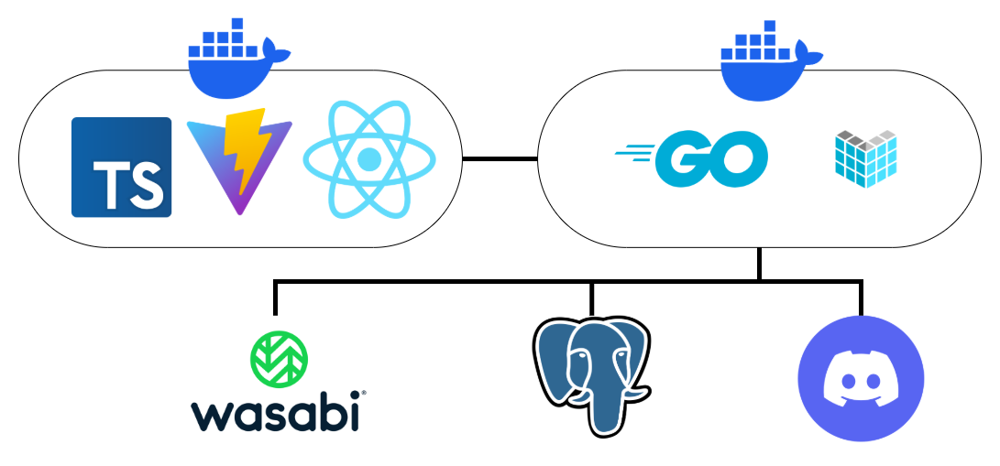

# ToyBox Backend Design Doc

## 著者

- simesaba80

## 開発者

- simesaba80
- Taku2515

## 目次

1. [目標](#目標としないもの)
2. [目標としないもの](#目標としないもの)
3. [背景](#背景)
4. [要件定義](#要件定義)
5. [システム概要](#システム概要)
6. [アーキテクチャ設計](#アーキテクチャ設計)
7. [データベース](#データベース)
8. [セキュリティ](#セキュリティ)
9. [運用方針](#運用方針)
10. [テスト方針](#テスト方針)
11. [更新履歴](#更新履歴)

# 目標

このソフトウェアの目的は C3 部員の継続的な内部及び外部との交流であり、既存の Toybox の作品部分リプレイスを実現することがゴールである

# 目標としないもの

- ブログの投稿プラットフォームとしての機能
  - ブログの投稿プラットフォームは別のシステムとして提供する予定である。そのためこのバックエンドは作品の取り扱いのみに集中する。

# 背景

このバックエンドのプロジェクトは前身となるバックエンドが既に作成されています。以下がリポジトリの URL。
https://github.com/Kyutech-C3/toybox-server
前 ToyBox の特徴は以下の通り

- FastAPI
- 作品投稿プラットフォームおよびブログ投稿プラットフォームとしての機能
- 現在の部員に扱える人がいない技術構成
- バグが多く保守性に難あり

そのため現 C3 部員で扱える人が多い Go を使い、保守性を重視したクリーンアーキテクチャを採用しつつ再開発を進めている。
以下の条件で開発する。

- データベースに保存されたデータのみ引き継ぎ
- デザインや API は 1 から開発

## 参考 URL

[前 ToyBox バックエンド](https://github.com/Kyutech-C3/toybox-server)  
[前 ToyBox フロントエンド](https://github.com/Kyutech-C3/ToyBox-frontend)  
[現 ToyBox バックエンド](https://github.com/simesaba80/toybox-back)  
[現 ToyBox フロントエンド](https://github.com/simesaba80/toybox-front)

# 要件定義

## ユースケース

- 作品の投稿/編集/公開/削除
- 一覧、検索(ページネーション/ソート/フィルタ)
- 作品の取得、詳細取得
- コメントの投稿、削除
- Discord でのログイン、ログアウト
- ユーザー作成、編集、取得

## 機能要件

- 認証/認可

  - Discord 認証のみサポート

- ユーザー

  - プロフィール取得
  - プロフィール編集

- 作品

  - 作品の CRUD
  - 公開、限定公開、下書きの区別
  - タグの追加、削除
  - サムネイルやアセットの追加
  - 外部リンクの挿入

- 一覧/検索

  - ページネーション
  - ソート(新着、人気順)
  - フィルタ(タグ、ユーザー、作品名)

- メディア
  // TODO

- データ移行
  - 旧 DB→ 新 DB への移行
  - DTO のマッピング

# システム概要

このシステムは以下のようなアーキテクチャで提供されます。

バックエンドの採用技術は以下の通りです。

- Go
- Echo(Web フレームワーク)
- Bun(ORM)
- wire(DI 用の CLI)
- golang-migrate(migrate 用の CLI)
- swag(Swagger 生成用の CLI)

これらの技術の選定基準は以下の通りです。

- 後方互換性が担保されているか、破壊的変更の頻度が少ないか
- 技術の習得難度が高すぎないか
- 調べる上で情報を見つけやすいか
- 言語以外の技術は簡単に扱うためのラッパーとして機能してくれるか

採用されていない類似技術については[代替案の検討](#代替案の検討)を参照。
アプリケーション、データベース共に Docker コンテナ内で動くことを想定されています。

# アーキテクチャ設計

このプロジェクトでは前 ToyBox バックエンドの反省から長期開発する上で保守性を確保するため、クリーンアーキテクチャを採用しています。  
4 層からなるクリーンアーキテクチャとなっており、以下の 4 層に分かれています。

- ドメイン層
- ユースケース層
- インターフェース層
- インフラストラクチャー層

## ドメイン層

このバックエンドが扱うドメインについて記述します。

- DB に保存されている情報と等価ではありません。
- 他のどの層にも依存しません。
- 外部ライブラリにも依存しません。
  現在は一部 UUID のライブラリに依存しているので剥がす必要があります。

### entity

ドメインのモデルについてのみ記述しており、構造体以外は存在しません。

- 依存関係を保つために、値のバリデーションはインターフェース層で行います。
- 現在一部モデルには Validate メソッドが実装されていますが使われていません。消去する必要があります。

### repository

ドメインの各モデルが持つメソッドのインターフェースを定義します。

- 実装はインフラストラクチャー層のリポジトリで行います。
- ドメイン層が実装に依存しないように依存関係の逆転を行っています。

## ユースケース層

ドメイン層にのみ依存し、ビジネスロジックを記述します。

- 例外処理や計算、インターフェースのバリデーターでは処理しきれない値の妥当性や整合性の確認、ドメインのインターフェースを介した SQL の呼び出しなどを行います。
- 現状一つのファイルに一つのドメインが対応する形でファイル分割をしています。
- 今後分割の仕方が変わる可能性があります。

## インターフェース層

以下のことを担当します。

- インフラストラクチャー層とユースケース層の橋渡しをします。
- ユースケース層とドメイン層に依存します。
- 主に http リクエストの変換等を行います。

### controller

- 必要に応じてバリデートやパラメータの取得をします。
- 処理後はユースケース層に引き渡します。ユースケース層からの返り値に応じて http レスポンスを返します。
  現状一つのファイルに一つのドメインが対応する形でファイル分割をしています。
  多くなりすぎる場合分割する必要があります。

### schema

以下のことを行います。

- http リクエストのボディの形式やレスポンスの形式の定義
- ドメインモデルからレスポンスへの変換等

こちらも現状一つのファイルに一つのドメインが対応する形でファイル分割をしています。多くなりすぎる場合分割する必要があります。

## インフラストラクチャー層

以下のことを担当します。

- アプリケーションと外部との間のやりとりを担当します。
- クリーンアーキテクチャにおける最も外側の層にあたります
- 上記 3 つ全ての層に依存します。
- 現在は環境変数、データベース、Web フレームワークを取り扱っています。

### config

環境変数の読み込みを行います。

### database

データベース関連のコードがあります。

- dto ではテーブル定義と Go の変換をしています。
- types では PostgreSQL のユーザー独自型の実装をしています。
- ドメイン層で定義したインターフェースの実装を行っています。
- SQL の実行等を主に担当します。

現在はここでトランザクションの管理も行っています。トランザクション自体は DB の概念だけでなくのより上位の概念としても存在するのでユースケース層に移動する必要があります。

#### dto

data transfer object の略です。テーブル定義と Go の構造体で 1 対 1 対応するものが格納されています。  
1 テーブル毎に 1 ファイルとなっています。構造体の定義と、ドメインモデルと dto の相互変換のメソッドが定義されています。

#### types

ユーザ定義の型を Bun で取り扱うためのコードを格納します。ここで定義しておくことで SQL を叩く際に Bun がラップを行いユーザ定義の型を取り扱いやすくなります。

### router

Echo を使ったルーティングやルーティングを行うルーターオブジェクトのカスタマイズを行います。
現在はバリデーションのみカスタマイズを行っています。

# DI

現在/internal/di で wire を使い依存関係の注入を行っています、開発中に依存関係の追加や変更があった場合は、wire.go に変更を加え、wire コマンドを使うことで更新します。

# データベース

Docker 上の PostgreSQL v17.6 を使用しています。テーブル定義する場合は単数形で命名します。
マイグレーションには golang-migrate と呼ばれる CLI を使用しています。
https://github.com/golang-migrate/migrate
テーブル定義等に変更を加える場合は既存の SQL に変更を加えるのではなく新たにマイグレーションを積み重ねるようにします。

## 時間について

- DB 内では Timezone ありで JST として保存します
- プログラム中では RFC3339 としてフォーマットします

# セキュリティ

このアプリケーションでは認証が必要になります。現時点では前 ToyBox と同様に Discord 認証のみを組み込むことを予定しています。Email 認証やその他の認証、SSO などは組み込みません。

# 運用方針

VPS 上で Docker を使い動かすことを想定しています。1 日に 1 度朝 5 時に DB に関してはバックアップを取得します。

# テスト方針

//TODO

# 更新履歴

2025/10/02 simesaba80
2025/10/07 simesaba80
